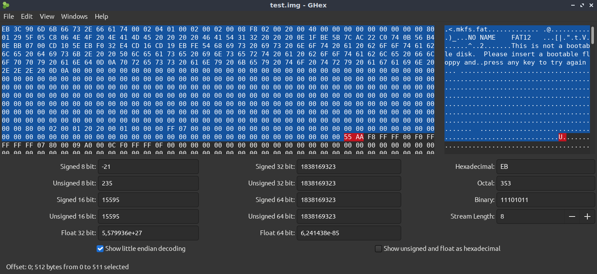
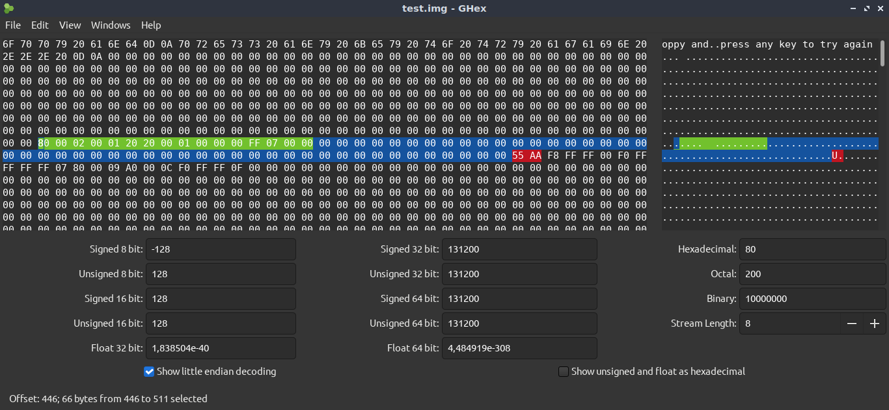
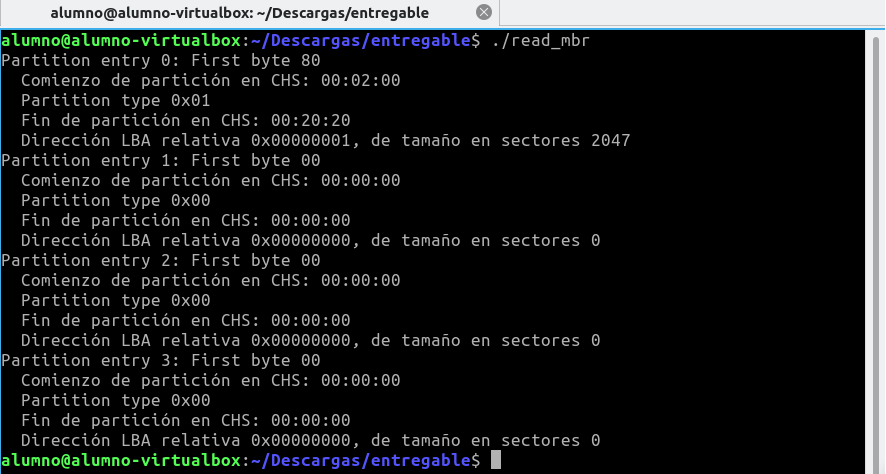
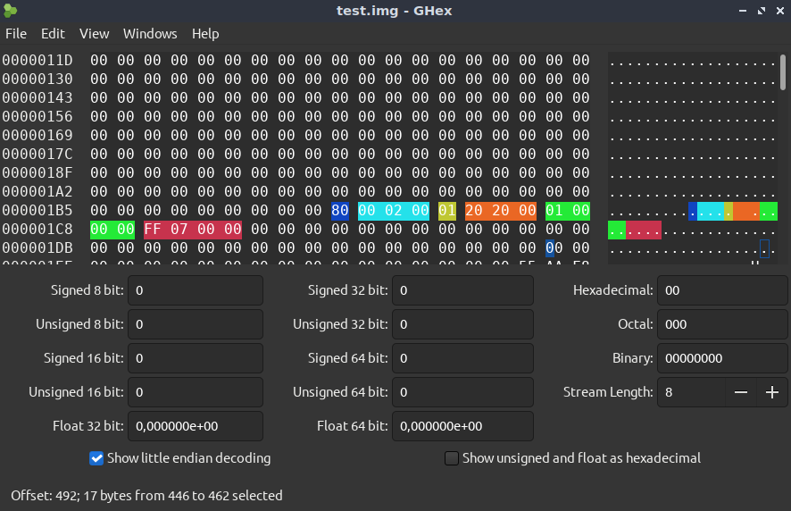
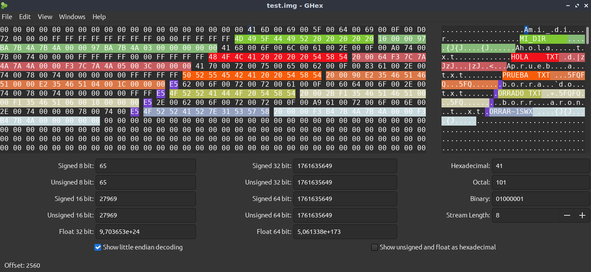

# Sistemas Operativos y Redes II
## **TP1 - FAT (O un tp muy grande)**


**_Autores:_**
- _Arévalo, Sabrina_
- _Arriola, Matías Agustín_
- _Curcio, Matías_
- _Farias, Federico_
- _Gomes Da Silva, Giuliano_

**_Docentes:_**
- _Chuquimango Chilon, Luis Benjamin_
- _Echabarri, Alan Pablo Daniel_

_Fecha: 1° Semestre 2024_
_Universidad Nacional General Sarmiento_


---

## Tabla de contenidos 
<!-- no toc -->
- [Introduccion](#Introduccion)
- [Montaje](#Montaje)
- [Requisitos previos](#requisitos-previos)
- [Exploración del MBR](#exploración-del-mbr)
    - [Cargando el MBR](#cargando-el-mbr)
    - [Estructura de datos del MBR](#estructura-de-datos-del-mbr)
    - [Particiones del MBR](#observando-las-particiones-del-mbr)
    - [Mostrando los datos desde C](#mostrando-el-mbr-desde-c)
    - [Analizando la primer partición](#analizando-la-primer-particion)
    - [Estructura de datos de una particion del MBR](#estructura-de-datos-de-una-partición-dentro-del-mbr)
    - [Tabla de tipos de particiones](#tabla-de-tipos-de-particiones)
- [Exploración de la tabla de archivos](#exploración-de-la-tabla-de-archivos)


## Introduccion
El objetivo de este informe es realizar una exploración en profundidad del sistema de archivos `FAT 12`. 

Para ello, utilizaremos un archivo de imagen provisto, llamado `test.img`, el cual iremos leyendo a bajo nivel e identificando distintos aspectos importantes de la teoría vista en clase.

## Montaje

Como primera medida, deberemos montar el archivo de imagen. Para esto, utilizaremos el comando: 

```bash
mount test.img /mnt -o loop,umask=000 
```

Notemos que con este comando estamos, por un lado especificando la ubicacion de montaje de la iso (Es decir, en /mnt) y, estableciendo permisos para archivos y directorios por el otro.

Respecto a esto ultimo, es importante mencionar que los sistemas de archivos FAT no mantienen los mismos controles de permisos que los sistemas de archivos nativos de Linux (Como ext4), y en lugar de permisos estilo POSIX, tienen un conjunto de permisos mas limitados para sus archivos y directorios. 
Generalmente, estos permisos se especifican a nivel de montaje y es en este contexto, en el cual el comando `umask=000` especifica que todos los archivos y directorios sean accesibles para lectura, escritura y ejecucion para todos los usuarios. 

## Requisitos previos

Para poder realizar la exploración, es necesario instalar un editor hexadecimal el cual nos permita leer los archivos a bajo nivel y así poder identificar el contenido de cada byte, e incluso traducirlo a los formatos que sean necesarios.
En este caso utilizaremos [ghex](https://github.com/GNOME/ghex).

## Exploración del MBR

### Cargando el MBR

Como primera medida, observemos la estructura de datos del MBR: 

#### Estructura de datos del MBR
| Byte Range |	Description	                | Essential |
| ---------- | ---------------------------- | --------- |
| 0-445	     |  Boot Code	                | No        |
| 446-461    |	Partition Table Entry #1	| Yes       |
| 462-477    |	Partition Table Entry #2	| Yes       |
| 478-493    |	Partition Table Entry #3	| Yes       |
| 494-509    |	Partition Table Entry #4	| Yes       |
| 510-511    |	Signature value (0xAA55)	| Yes       |


El archivo de imagen `test.img` pesa 1MB y según podemos observar en la tabla, el MBR se encuentra en los primeros 512 bytes del mismo.

Además, teniendo en cuenta que un byte ocupa 2 caracteres y utilizando la vista en bytes de ghex, podemos observar que el byte **EB** indica el inicio del MBR. 
Luego, para poder identificar donde termina basta con que busquemos en esta vista el Signature Value. Es decir, **0xAA55**[^1].



### Observando las particiones del MBR

Segun la información provista en la [estructura de datos del MBR](#estructura-de-datos-del-mbr), entre los bytes 446 y 511 (Es decir, el anterior al Signature Value) se encuentran las entradas que identifican las particiones que lo componen. Observemos dicho rango de bytes en la siguiente imagen:  



Los bytes resaltado en amarillo (Del 446 al 461), se corresponden con la **primer partición del MBR**, y considerando que inicia con  80, podemos identificarla como una **partición activa**. 

Luego, todos los bytes siguientes hasta el Signature Value (Señalado en rojo) se encuentran en 00, con lo cual solamente existe una particion en test.img.

### Mostrando el MBR desde C

Para poder observar toda esta información de una forma más sencilla, desarrollaremos un pequeño programa en C para que nos la muestre por consola. 

Para ello, partimos del codigo provisto en el archivo `read_mbr.c` y modificaremos la funcion **SEEK**. 

La función ``fseek()`` nos permite cambiar la posición del puntero de archivo asociado a un archivo abierto. 
En este caso, la utilizaremos para mover el puntero de lectura especificamente al byte 446, a partir del cual podremos ir listando cada una de las particiones encontradas:

De esta forma, obtenemos el siguiente código:

```c
#include <stdio.h>
#include <stdlib.h>

int main() {
    FILE * in = fopen("test.img", "rb");
    unsigned int i, start_sector, length_sectors;
    
    fseek(in, 446 , SEEK_SET);
    
    for(i=0; i<4; i++) { // Leo las entradas
        printf("Partition entry %d: First byte %02X\n", i, fgetc(in));
        printf("  Comienzo de partición en CHS: %02X:%02X:%02X\n", fgetc(in), fgetc(in), fgetc(in));
        printf("  Partition type 0x%02X\n", fgetc(in));
        printf("  Fin de partición en CHS: %02X:%02X:%02X\n", fgetc(in), fgetc(in), fgetc(in));
        
        fread(&start_sector, 4, 1, in);
        fread(&length_sectors, 4, 1, in);
        printf("  Dirección LBA relativa 0x%08X, de tamaño en sectores %d\n", start_sector, length_sectors);
    }
    
    fclose(in);
    return 0;
}
```

Para compilar y ejecutar este código utilizamos los comandos:

```sh
    gcc read_mbr.c -o read mb
    ./read_mbr
```
y podemos observar el resultado: 



### Analizando la primer particion

Para poder analizar mas a detalle la primer (y única) partición del MBR, observemos la siguiente tabla que nos indica la estructura de datos de las particiones del MBR: 

#### Estructura de datos de una partición dentro del MBR

| Byte Range | Description          | Essential |
|------------|----------------------|-----------|
| 0-0        | Bootable Flag        | No        |
| 1-3        | Starting CHS Address | Yes       |
| 4-4        | Partition Type       | Yes       |
| 5-7        | Ending CHS Address   | Yes       |
| 8-11       | Starting LBA Address | Yes       |
| 12-15      | Size in Sectors      | Yes       |

Con la información que nos proporciona esta tabla, podemos segmentar los 15 bytes que componen la primer partición de la siguiente forma e ir identificando que indica cada uno de ellos: 



#### OBSERVACIONES
- El bootable flag (En azul) es 0x08, lo cual nos indica que es booteable, ya que de no serlo, el valor sería 0x00. <ins>_¿Puede ser que que sea 0x08 indica que es un Volumen? Y por eso podemos justificar que es booteable?_<ins>
- Los bytes en celeste y naranja, indican donde inicia y termina el Cylinder Head Sector respectivamente. 
- El byte en amarillo, indica el tipo de partición. En este caso 0x01. 
Segun la siguiente tabla, el byte 0x01 indica que es una particion **FAT12 CHS**:

#### Tabla de tipos de particiones

| Type | Description                   |
|------|-------------------------------|
| 0x00 | Empty                         |
| <ins> **0x01**<ins> | <ins>**FAT12, CHS** <ins>                    |
| 0x04 | FAT16, 16-32 MB, CHS          |
| 0x05 | Microsoft Extended, CHS       |
| 0x06 | FAT16, 32 MB-2 GB, CHS        |
| 0x07 | NTFS                          |
| 0x0b | FAT32, CHS                    |
| 0x0c | FAT32, LBA                    |
| 0x0e | FAT16, 32 MB-2 GB, LBA        |
| 0x0f | Microsoft Extended, LBA       |
| 0x11 | Hidden FAT12, CHS             |
| 0x14 | Hidden FAT16, 16-32 MB, CHS   |
| 0x16 | Hidden FAT16, 32 MB-2 GB, CHS |
| 0x1b | Hidden FAT32, CHS             |
| 0x1c | Hidden FAT32, LBA             |
| 0x1e | Hidden FAT16, 32 MB-2 GB, LBA |
| 0x42 | Microsoft MBR. Dynamic Disk   |
| 0x82 | Solaris x86                   |
| 0x82 | Linux Swap                    |
| 0x83 | Linux                         |
| 0x84 | Hibernation                   |
| 0x85 | Linux Extended                |
| 0x86 | NTFS Volume Set               |
| 0x87 | NTFS Volume Set               |
| 0xa0 | Hibernation                   |
| 0xa1 | Hibernation                   |
| 0xa5 | FreeBSD                       |
| 0xa6 | OpenBSD                       |
| 0xa8 | Mac OSX                       |
| 0xa9 | NetBSD                        |
| 0xab | Mac OSX Boot                  |
| 0xb7 | BSDI                          |
| 0xb8 | BSDI swap                     |
| 0xee | EFI GPT Disk                  |
| 0xef | EFI System Partition          |
| 0xfb | Vmware File System            |
| 0xfc | Vmware swap                   |

- El tamaño en sectores de la particion (Indicado en los bytes en rojo) es FF 07, es decir 2047 [^2]. 


[^1]: Notemos que por la notación Big Endian, encontrar el Signature Value **0xAA55** equivale a identificar en el editor hexadecimal los caracteres de forma invertida (Ya que está expresado bajo la notación Little-Endian), es decir **55 AA**.

[^2] Este valor se obtiene expresando los bytes como un entero sin signo de 16 bits, teniendo en consideración que están bajo el orden Little-Endian.

### Mostrando la información del MBR desde C

Nuevamente, para poder ver la información mas facilmente desarrollaremos un programa en C que imprima todos estos datos por consola. 

Para ello, partimos del codigo provisto en el archivo `read_boot.c` y haremos las modificaciones necesarias. (<ins> _**Falta explicar un poco mas el porque**_<ins>)

De esta forma, el código queda de la siguiente manera: 

```c
#include <stdio.h>
#include <stdlib.h>

typedef struct {
    unsigned char first_byte;
    unsigned char start_chs[3];
    unsigned char partition_type;
    unsigned char end_chs[3];
    char start_sector[4];
    char length_sectors[4];
} __attribute__((packed)) PartitionTable;

typedef struct {
    unsigned char jmp[3];
    char oem[8];
    unsigned short sector_size; // 2 bytes
    unsigned char sectors_per_cluster; // 1 byte
    unsigned short reserved_sectors; // 2 bytes
    unsigned char number_of_fats; // 1 byte
    unsigned short max_root_entries; // 2 bytes
    unsigned short total_sectors; // 2 bytes
    unsigned char media_descriptor; // 1 byte
    unsigned short sectors_per_fat; // 2 bytes
    unsigned short sectors_per_track; // 2 bytes
    unsigned short number_of_heads; // 2 bytes
    unsigned int hidden_sectors; // 4 bytes
    unsigned int total_logical_sectors; // 4 bytes
    unsigned char drive_number; // 1 byte
    unsigned char reserved; // 1 byte
    unsigned char boot_signature; // 1 byte
    unsigned int volume_id; // 4 bytes
    char volume_label[11];
    char fs_type[8]; // Tipo en ASCII
    char boot_code[448];
    unsigned short boot_sector_signature; // 2 bytes
} __attribute__((packed)) Fat12BootSector;

int main() {
    FILE *in = fopen("test.img", "rb");
    int i;
    PartitionTable pt[4];
    Fat12BootSector bs;

    fseek(in, 0x1BE, SEEK_SET); // Ir al inicio de la tabla de particiones
    fread(pt, sizeof(PartitionTable), 4, in); // Leer entradas de la tabla de particiones

    for (i = 0; i < 4; i++) {
        printf("Tipo de partición: %d\n", pt[i].partition_type);
        if (pt[i].partition_type == 1) {
            printf("Encontrado sistema de archivos FAT12 en la partición %d\n", i);
            break;
        }
    }

    if (i == 4) {
        printf("No se encontró un sistema de archivos FAT12, saliendo...\n");
        return -1;
    }

    fseek(in, 0, SEEK_SET);
    fread(&bs, sizeof(Fat12BootSector), 1, in);

    printf("Código de salto: %02X:%02X:%02X\n", bs.jmp[0], bs.jmp[1], bs.jmp[2]);
    printf("Código OEM: [%.8s]\n", bs.oem);
    printf("Tamaño del sector: %d\n", bs.sector_size);
    printf("Sectores por clúster: %d\n", bs.sectors_per_cluster);
    printf("Sectores reservados: %d\n", bs.reserved_sectors);
    printf("Número de FATs: %d\n", bs.number_of_fats);
    printf("Entradas máximas en el directorio raíz: %d\n", bs.max_root_entries);
    printf("Total de sectores: %d\n", bs.total_sectors);
    printf("Descriptor de medios: %d\n", bs.media_descriptor);
    printf("Sectores por FAT: %d\n", bs.sectors_per_fat);
    printf("Sectores por pista: %d\n", bs.sectors_per_track);
    printf("Número de cabezas: %d\n", bs.number_of_heads);
    printf("Sectores ocultos: %d\n", bs.hidden_sectors);
    printf("Sectores lógicos totales: %d\n", bs.total_logical_sectors);
    printf("Número de unidad: %d\n", bs.drive_number);
    printf("Reservado: %d\n", bs.reserved);
    printf("Firma de arranque: %d\n", bs.boot_signature);
    printf("ID del volumen: 0x%08X\n", bs.volume_id);
    printf("Etiqueta del volumen: [%.11s]\n", bs.volume_label);
    printf("Tipo de sistema de archivos: [%.8s]\n", bs.fs_type);
    printf("Firma del sector de arranque: 0x%04X\n", bs.boot_sector_signature);

    fclose(in);
    return 0;
}
```

Si compilamos y ejecutamos este código utilizando los comandos:

```sh
    gcc read_boot.c -o read_boot
    ./read_mbr
```
y podemos observar el resultado: 


## Exploración de la tabla de archivos

Comenzemos esta exploración listando los 5 archivos que podemos identificar: 



En la imagen se encuentran resaltados los bytes correspondientes a cada archivo con un mismo tono de color, donde los primeros 11 bytes destinados al nombre que lo identifica están en un tono mas oscuro y los bytes restantes que contienen la metadata del mismo en uno mas claro. Para tener mas noción de que información nos brindan los bytes con la metadata, debemos tener en cuenta las siguientes tablas: 


 
Con toda esta información, vamos a mencionar algunas particularidades de los archivos: 

* Notemos que el primer byte (Luego de los bytes que representan el nombre) del archivo **MI_DIR** (Bytes resaltados en Verde) es **0x10**. Este byte representa el tipo de archivo, y si consideramos la tabla mostrada anteriormente, vemos que esto representa un **directorio**.

* Los archivos **HOLA.TXT** (Bytes resaltados en rojo), **PRUEBA.TXT** (Bytes resaltados en naranja) representan archivos propiamente dichos (Pues el byte que nos lo indica es **0x20**)

* Los archivos **BORRADO.TXT** () y **BORRAR.SWX** también son archivos, con la particularidad de que el primer byte es **0xE5**, es decir ambos son archivos que fueron borrados (Solamente a nivel lógico).