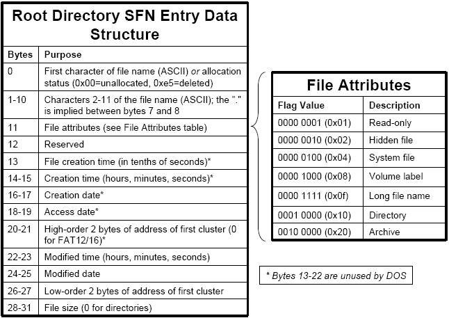

# Sistemas Operativos y Redes II
## **TP1 - FAT (O un tp muy grande)**


**_Autores:_**
- _Arévalo, Sabrina_
- _Arriola, Matías Agustín_
- _Curcio, Matías_
- _Farias, Federico_
- _Gomes Da Silva, Giuliano_

**_Docentes:_**
- _Chuquimango Chilon, Luis Benjamin_
- _Echabarri, Alan Pablo Daniel_

_Fecha: 1° Semestre 2024_
_Universidad Nacional General Sarmiento_


---

## Tabla de contenidos 
<!-- no toc -->
- [Introduccion](#Introduccion)
- [Montaje](#Montaje)
- [Requisitos previos](#requisitos-previos)
- [Exploración del MBR](#exploración-del-mbr)
    - [Cargando el MBR](#cargando-el-mbr)
    - [Estructura de datos del MBR](#estructura-de-datos-del-mbr)
    - [Particiones del MBR](#observando-las-particiones-del-mbr)
    - [Mostrando los datos desde C](#mostrando-el-mbr-desde-c)
    - [Analizando la primer partición](#analizando-la-primer-particion)
    - [Estructura de datos de una particion del MBR](#estructura-de-datos-de-una-partición-dentro-del-mbr)
    - [Tabla de tipos de particiones](#tabla-de-tipos-de-particiones)
- [Exploración de la tabla de archivos](#exploración-de-la-tabla-de-archivos)
  - [Formato de entradas](#formato-de-entradas-de-directorio)
  - [Mostrando los archivos del fileSystem desde C](#mostrando-los-archivos-del-filesystem-desde-c)
  - [Primeras conclusiones](#primeras-conclusiones)
- [Leyendo Archivos](#leyendo-los-archivos)
  - [Creando archivo lapapa.txt](#preparando-lo-necesario)
  - [Mostrando el contenido del archivo](#mostrando-el-contenido-del-archivo)
  - [Eliminando y recuperando el contenido del archivo](#recuperando-el-archivo) 
- [Notas al pie](#notas-al-pie)
- [Bibliografía](#bibliografía)

---


## Introduccion
El objetivo de este informe es realizar una exploración en profundidad del sistema de archivos `FAT 12`. 

Para ello, utilizaremos un archivo de imagen provisto, llamado `test.img`, el cual iremos leyendo a bajo nivel e identificando distintos aspectos importantes de la teoría vista en clase.

## Montaje

Como primera medida, deberemos montar el archivo de imagen. Para esto, utilizaremos el comando: 

```bash
mount test.img /mnt -o loop,umask=000 
```

Notemos que con este comando estamos, por un lado especificando la ubicacion de montaje de la iso (Es decir, en /mnt) y, estableciendo permisos para archivos y directorios por el otro.

Respecto a esto ultimo, es importante mencionar que los sistemas de archivos FAT no mantienen los mismos controles de permisos que los sistemas de archivos nativos de Linux (Como ext4), y en lugar de permisos estilo POSIX, tienen un conjunto de permisos mas limitados para sus archivos y directorios. 
Generalmente, estos permisos se especifican a nivel de montaje y es en este contexto, en el cual el comando `umask=000` especifica que todos los archivos y directorios sean accesibles para lectura, escritura y ejecucion para todos los usuarios. 

## Requisitos previos

Para poder realizar la exploración, es necesario instalar un editor hexadecimal el cual nos permita leer los archivos a bajo nivel y así poder identificar el contenido de cada byte, e incluso traducirlo a los formatos que sean necesarios.
En este caso utilizaremos [ghex](https://github.com/GNOME/ghex).

## Exploración del MBR

### Cargando el MBR

Como primera medida, observemos la estructura de datos del MBR: 

#### Estructura de datos del MBR
| Byte Range |	Description	                | Essential |
| ---------- | ---------------------------- | --------- |
| 0-445	     |  Boot Code	                | No        |
| 446-461    |	Partition Table Entry #1	| Yes       |
| 462-477    |	Partition Table Entry #2	| Yes       |
| 478-493    |	Partition Table Entry #3	| Yes       |
| 494-509    |	Partition Table Entry #4	| Yes       |
| 510-511    |	Signature value (0xAA55)	| Yes       |


El archivo de imagen `test.img` pesa 1MB y según podemos observar en la tabla, el MBR se encuentra en los primeros 512 bytes del mismo.

Además, teniendo en cuenta que un byte ocupa 2 caracteres y utilizando la vista en bytes de ghex, podemos observar que el byte **EB** indica el inicio del MBR. 
Luego, para poder identificar donde termina basta con que busquemos en esta vista el Signature Value. Es decir, **0xAA55**[^1].


### Observando las particiones del MBR

Segun la información provista en la [estructura de datos del MBR](#estructura-de-datos-del-mbr), entre los bytes 446 y 511 (Es decir, el anterior al Signature Value) se encuentran las entradas que identifican las particiones que lo componen. Observemos dicho rango de bytes en la siguiente imagen:  


Los bytes resaltado en verde (Del 446 al 461), se corresponden con la **primer partición del MBR**, y considerando que inicia con  80, podemos identificarla como una **partición activa**. 

Luego, todos los bytes siguientes hasta el Signature Value (Señalado en rojo) se encuentran en 00, con lo cual solamente existe una particion en test.img.

### Mostrando el MBR desde C

Para poder observar toda esta información de una forma más sencilla, desarrollaremos un pequeño programa en C para que nos la muestre por consola. 

Para ello, partimos del codigo provisto en el archivo `read_mbr.c` y modificaremos la funcion **SEEK**. 

La función ``fseek()`` nos permite cambiar la posición del puntero de archivo asociado a un archivo abierto. 
En este caso, la utilizaremos para mover el puntero de lectura especificamente al byte 446, a partir del cual podremos ir listando cada una de las particiones encontradas:

De esta forma, obtenemos el siguiente código:

```c
#include <stdio.h>
#include <stdlib.h>

int main() {
    FILE * in = fopen("test.img", "rb");
    unsigned int i, start_sector, length_sectors;
    
    fseek(in, 446 , SEEK_SET);
    
    for(i=0; i<4; i++) { // Leo las entradas
        printf("Partition entry %d: First byte %02X\n", i, fgetc(in));
        printf("  Comienzo de partición en CHS: %02X:%02X:%02X\n", fgetc(in), fgetc(in), fgetc(in));
        printf("  Partition type 0x%02X\n", fgetc(in));
        printf("  Fin de partición en CHS: %02X:%02X:%02X\n", fgetc(in), fgetc(in), fgetc(in));
        
        fread(&start_sector, 4, 1, in);
        fread(&length_sectors, 4, 1, in);
        printf("  Dirección LBA relativa 0x%08X, de tamaño en sectores %d\n", start_sector, length_sectors);
    }
    
    fclose(in);
    return 0;
}
```

Para compilar y ejecutar este código utilizamos los comandos:

```sh
    gcc read_mbr.c -o read_mbr
    ./read_mbr
```
y podemos observar el resultado: 


### Analizando la primer particion

Para poder analizar mas a detalle la primer (y única) partición del MBR, observemos la siguiente tabla que nos indica la estructura de datos de las particiones del MBR: 

#### Estructura de datos de una partición dentro del MBR

| Byte Range | Description          | Essential |
|------------|----------------------|-----------|
| 0-0        | Bootable Flag        | No        |
| 1-3        | Starting CHS Address | Yes       |
| 4-4        | Partition Type       | Yes       |
| 5-7        | Ending CHS Address   | Yes       |
| 8-11       | Starting LBA Address | Yes       |
| 12-15      | Size in Sectors      | Yes       |

Con la información que nos proporciona esta tabla, podemos segmentar los 15 bytes que componen la primer partición de la siguiente forma e ir identificando que indica cada uno de ellos: 


#### OBSERVACIONES
- El bootable flag (En azul) es 0x08, lo cual nos indica que es booteable, ya que de no serlo, el valor sería 0x00. <ins>
- Los bytes en celeste y naranja, indican donde inicia y termina el Cylinder Head Sector respectivamente. 
- El byte en amarillo, indica el tipo de partición. En este caso 0x01. 
Segun la siguiente tabla, el byte 0x01 indica que es una particion **FAT12 CHS**:

#### Tabla de tipos de particiones

| Type | Description                   |
|------|-------------------------------|
| 0x00 | Empty                         |
| <ins> **0x01**<ins> | <ins>**FAT12, CHS** <ins>                    |
| 0x04 | FAT16, 16-32 MB, CHS          |
| 0x05 | Microsoft Extended, CHS       |
| 0x06 | FAT16, 32 MB-2 GB, CHS        |
| 0x07 | NTFS                          |
| 0x0b | FAT32, CHS                    |
| 0x0c | FAT32, LBA                    |
| 0x0e | FAT16, 32 MB-2 GB, LBA        |
| 0x0f | Microsoft Extended, LBA       |
| 0x11 | Hidden FAT12, CHS             |
| 0x14 | Hidden FAT16, 16-32 MB, CHS   |
| 0x16 | Hidden FAT16, 32 MB-2 GB, CHS |
| 0x1b | Hidden FAT32, CHS             |
| 0x1c | Hidden FAT32, LBA             |
| 0x1e | Hidden FAT16, 32 MB-2 GB, LBA |
| 0x42 | Microsoft MBR. Dynamic Disk   |
| 0x82 | Solaris x86                   |
| 0x82 | Linux Swap                    |
| 0x83 | Linux                         |
| 0x84 | Hibernation                   |
| 0x85 | Linux Extended                |
| 0x86 | NTFS Volume Set               |
| 0x87 | NTFS Volume Set               |
| 0xa0 | Hibernation                   |
| 0xa1 | Hibernation                   |
| 0xa5 | FreeBSD                       |
| 0xa6 | OpenBSD                       |
| 0xa8 | Mac OSX                       |
| 0xa9 | NetBSD                        |
| 0xab | Mac OSX Boot                  |
| 0xb7 | BSDI                          |
| 0xb8 | BSDI swap                     |
| 0xee | EFI GPT Disk                  |
| 0xef | EFI System Partition          |
| 0xfb | Vmware File System            |
| 0xfc | Vmware swap                   |

- El tamaño en sectores de la particion (Indicado en los bytes en rojo) es FF 07, es decir 2047[^2]. 

### Mostrando la información del MBR desde C

Nuevamente, para poder ver la información mas facilmente desarrollaremos un programa en C que imprima todos estos datos por consola. 

Para ello, partimos del codigo provisto en el archivo `read_boot.c` y haremos las modificaciones necesarias para restringir la salida por consola a solamente la primer partición del MBR. 

De esta forma, el código queda de la siguiente manera: 

```c
#include <stdio.h>
#include <stdlib.h>

int main() {
    FILE * in = fopen("test.img", "rb");
    unsigned int i, start_sector, length_sectors;
    
    fseek(in, 446 , SEEK_SET); // Voy al inicio.
    
    for(i=0; i<1; i++) { // Leo las entradas
        printf("Partition entry %d:\n  Bootable flag: %02X\n", i, fgetc(in));
        printf("  Comienzo de partición en CHS: %02X:%02X:%02X\n", fgetc(in), fgetc(in), fgetc(in));
        printf("  Partition type 0x%02X\n", fgetc(in));
        printf("  Fin de partición en CHS: %02X:%02X:%02X\n", fgetc(in), fgetc(in), fgetc(in));
        
        fread(&start_sector, 4, 1, in);
        fread(&length_sectors, 4, 1, in);
        printf("  Dirección LBA relativa: 0x%08X\n  Tamaño en sectores: %d\n", start_sector, length_sectors);
    }
    
    fclose(in);
    return 0;
}
```

Si compilamos y ejecutamos este código utilizando los comandos:

```sh
    gcc read_first_partition.c -o read_first_partition
    ./read_first_partition
```
podemos observar el resultado: 


## Exploración de la tabla de archivos

Comenzemos esta exploración listando los 5 archivos que podemos identificar: 


En la imagen se encuentran resaltados los bytes correspondientes a cada archivo con un mismo tono de color, donde los primeros 11 bytes destinados al nombre que lo identifica están en un tono mas oscuro y los bytes restantes que contienen la metadata del mismo en uno mas claro. 

Para tener mas noción de que información nos brindan los bytes con la metadata, debemos tener en cuenta las siguientes tablas: 

#### Formato de entradas de directorio

 
Con toda esta información, vamos a mencionar algunas particularidades de los archivos: 

* Notemos que el primer byte (Luego de los bytes que representan el nombre) del archivo **MI_DIR** (Bytes resaltados en tonos verdes) es **0x10**. Este byte representa el tipo de archivo, y si consideramos la tabla mostrada anteriormente, vemos que esto representa un **directorio**.

* Los archivos **HOLA.TXT** (Bytes resaltados en tonos rojos), **PRUEBA.TXT** (Bytes resaltados en tonos naranjas) representan archivos propiamente dichos (Pues el byte que nos lo indica es **0x20**)

* Los archivos **BORRADO.TXT** (Bytes resaltados en tonos amarillos) y **BORRAR.SWX** (Bytes resaltados en azules) también son archivos, con la particularidad de que el primer byte es **0xE5**, es decir ambos son archivos que fueron borrad (Segun la información provista en la tabla).

### Mostrando los archivos del fileSystem desde C

Siguiendo la misma linea que con ejemplos anteriores, desarrollaremos un programa en C que imprima todos estos datos por consola. 

Para ello, partimos del codigo provisto en el archivo `read_root.c` y haremos las modificaciones necesarias para imprimir cada uno de los archivos que se encuentran en el filesystem, incluyendo algunos datos de cada uno de ellos.

```c
#include <stdio.h>
#include <stdlib.h>

typedef struct {
    unsigned char first_byte;
    unsigned char start_chs[3];
    unsigned char partition_type;
    unsigned char end_chs[3];
    char starting_cluster[4];
    char file_size[4];
} __attribute((packed)) PartitionTable;

typedef struct {
    unsigned char jmp[3];
    char oem[8];
    unsigned short sector_size;
    unsigned char sectors_per_cluster;
    unsigned short reserved_sectors;
    unsigned char number_of_fats;
    unsigned short root_dir_entries;
    unsigned short total_sectors_short; // if zero, later field is used
    unsigned char media_descriptor;
    unsigned short fat_size_sectors;
    unsigned short sectors_per_track;
    unsigned short number_of_heads;
    unsigned int hidden_sectors;
    unsigned int total_sectors_long;
    unsigned char drive_number;
    unsigned char current_head;
    unsigned char boot_signature;
    unsigned int volume_id;
    char volume_label[11];
    char fs_type[8];
    char boot_code[448];
    unsigned short boot_sector_signature;
} __attribute((packed)) Fat12BootSector;

typedef struct {
    unsigned char filename[8];                  // Nombre del archivo
    unsigned char ext[3];                       // Extensión del archivo
    unsigned char attributes[1];                // Atributos del archivo
    unsigned char reserved[2];                  // Reservado
    unsigned char created_time[2];              // Hora de creación
    unsigned char created_day[2];               // Fecha de creación
    unsigned char accessed_day[2];              // Fecha de último acceso
    unsigned char cluster_highbytes_address[2]; // Dirección de los bytes altos del clúster
    unsigned char written_time[2];              // Hora de última escritura
    unsigned char written_day[2];               // Fecha de última escritura
    unsigned short cluster_lowbytes_address;    // Dirección de los bytes bajos del clúster
    unsigned int size_of_file;                  // Tamaño del archivo
} __attribute((packed)) Fat12Entry;


void print_file_info(Fat12Entry *entry){
    unsigned char firstChar = entry->filename[0];
    if (firstChar == 0xE5 && entry->attributes[0] == ' ') {
        printf("Archivo borrado: [?%.7s.%.3s]\n", &entry->filename[1], entry->ext);
        return;
    } else if (firstChar == 0x05) {
        printf("Archivo que comienza con 0x05: [%c%.7s.%.3s]\n", 0xE5, &entry->filename[1], entry->ext);
        return;
    }

    switch(entry->attributes[0]) {
    case 0x10:
        printf("Directory: [%.8s.%.3s]\n", entry->filename, entry->ext);
        break;
    case 0x20:
    	printf("----------------------------------------------\n");
        printf("File: [%.8s.%.3s]\n", entry->filename, entry->ext);
        printf("Extension: %.3s\n", entry->ext);
        printf("Cluster (alta dirección de bytes): 0x%02X%02X\n", entry->cluster_highbytes_address[1], entry->cluster_highbytes_address[0]);
        printf("Cluster (baja dirección de bytes): 0x%02X%02X\n", entry->cluster_lowbytes_address >> 8, entry->cluster_lowbytes_address & 0xFF);
        printf("Tamaño de archivo: %d bytes\n", entry->size_of_file);
        printf("----------------------------------------------\n");
        break;
    }
}

int main() {
    FILE * in = fopen("test.img", "rb");
    int i;
    PartitionTable pt[4];
    Fat12BootSector bs;
    Fat12Entry entry;
   
    fseek(in, 446, SEEK_SET); // ir al inicio de la tabla de particiones
    fread(pt, sizeof(PartitionTable), 4, in); // leer tabla de particiones
    
    for(i=0; i<4; i++) {        
        if(pt[i].partition_type == 1) {
            printf("Encontrada particion FAT12 %d\n", i);
            break;
        }
    }
    
    if(i == 4) {
        printf("No encontrado filesystem FAT12, saliendo...\n");
        return -1;
    }
    
    fseek(in, pt[i].start_chs[2]*512, SEEK_SET);
    fread(&bs, sizeof(Fat12BootSector), 1, in); // leer boot sector
    
    printf("En  0x%lX, sector size %d, FAT size %d sectors, %d FATs\n\n", 
           ftell(in), bs.sector_size, bs.fat_size_sectors, bs.number_of_fats);
           
    fseek(in, (bs.reserved_sectors-1 + bs.fat_size_sectors * bs.number_of_fats) *
          bs.sector_size, SEEK_CUR);
    
    printf("Root dir_entries %d \n", bs.root_dir_entries);
    for(i=0; i<bs.root_dir_entries; i++) {
        fread(&entry, sizeof(entry), 1, in);
        print_file_info(&entry);
    }
    
    printf("\nLeido Root directory, ahora en 0x%lX\n", ftell(in));
    fclose(in);
    return 0;
}
```

Compilando y ejecutando este código utilizando los comandos:

```bash
    gcc read_root.c -o read_root
    ./read_root
```
podemos observar el resultado: 


En esta imagen podemos ver listados los 4 archivos (Incluyendo los dos que están marcados como eliminados), además del directorio **MI_DIR**.

### Creando archivos en Root

Para continuar con la exploración de la FAT, vamos a montar la unidad de imagen y crear un archivo dentro del directorio Root. 

Posteriormente, lo eliminaremos y mostraremos dicho archivo tanto por Ghex, como desde el código C desarrollado anteriormente: 

#### Montando el filesystem, y realizando operaciones con el archivo


#### Mostrandolo por ghex


#### Mostrandolo desde C


### Primeras conclusiones

Para encontrar el archivo eliminado, lo hicimos buscando el byte 0xE5, el cual sabemos (segun la tabla de [formato de las entradas](#formato-de-entradas-de-directorio)) nos indica si un archivo ha sido eliminado. 

Además, podemos notar que a pesar de que los archivos se borren, mantienen sus entradas en el filesystem. Esto quiere decir que no se borran a nivel físico, sino que simplemente se marcan como espacio disponible para ser utilizado en caso de ser necesario. 
Esto queda claramente en evidencia si hacemos dos observaciones: 

* Por un lado, podemos observar que luego de haber eliminado el archivo, aún quedan bytes de su contenido o su metadata (En este caso particular, esto es debido a que no han sido sobreescritos por algun otro archivo). 

* Por el otro, si comparamos el contenido inicial de ``test.img`` con el actual, vemos que el archivo EJ3b.txt que hemos creado (Y posteriormente eliminado) ocupo el lugar en el que antes estaba el archivo BORRADO.txt. Es decir, se sobreescribieron los datos de su entrada, debido a que al momento de eliminarlo, sus bytes se marcaron como espacio disponible.

**_Teniendo en cuenta estas observaciones, podemos deducir que es posible recuperar un archivo eliminado si sus datos no han sido sobreescritos._**

## Leyendo los archivos 

### Preparando lo necesario
Para realizar la siguiente exploracion, vamos a crear un archivo en el directorio root llamado _lapapa.txt_ con algun texto como contenido. 
Para ello, montaremos la imagen del filesystem y utilizaremos el comando: 

```bash 
echo Contenido de ejemplo >> lapapa.txt 
```


De la misma forma que hicimos anteriormente, vamos a mostrarlo tanto desde ghex como desde el código en C: 


### Mostrando el contenido del archivo

Para mostrar el contenido del archivo, hemos desarrollado el siguiente codigo en C: 

```c
#include <stdio.h>
#include <stdlib.h>
 
typedef struct {
    unsigned char first_byte;
    unsigned char start_chs[3];
    unsigned char partition_type;
    unsigned char end_chs[3];
    char start_sector[4];
    unsigned int length_sectors;
} __attribute((packed)) PartitionTable;
 
typedef struct {
    unsigned char jmp[3];
    char oem[8];
    unsigned short sector_size;
    unsigned char sector_cluster;
    unsigned short reserved_sectors;
    unsigned char number_of_fats;
    unsigned short root_dir_entries;
    unsigned short sector_volumen;
    unsigned char descriptor;
    unsigned short fat_size_sectors;
    unsigned short sector_track;
    unsigned short headers;
    unsigned int sector_hidden;
    unsigned int sector_partition;
    unsigned char physical_device;
    unsigned char current_header;
    unsigned char firm;
    unsigned int volume_id;
    char volume_label[11];
    char fs_type[8];
    char boot_code[448];
    unsigned short boot_sector_signature;
} __attribute((packed)) Fat12BootSector;
 
typedef struct {
    unsigned char filename[1];
    unsigned char nombre[7];
    unsigned char extension[3];
    unsigned char attributes[1];
    unsigned char reserved;
    unsigned char created_time_seconds;
    unsigned char created_time_hours_minutes_seconds[2];
    unsigned char created_day[2];
    unsigned char accessed_day[2];
    unsigned char cluster_highbytes_address[2];
    unsigned char written_time[2];
    unsigned char written_day[2];
    unsigned short cluster_lowbytes_address;
    unsigned int size_of_file;
} __attribute((packed)) Fat12Entry;
 
void print_file_info(Fat12Entry *entry, unsigned short firstCluster, unsigned short clusterSize) {
    switch(entry->filename[0]) {
    case 0x00:
        return; // unused entry
    case 0xE5:
        return;
    default:
        switch(entry->attributes[0]) {
            case 0x20:
            	
                printf("\n Archivo: [%.1s%.7s.%.3s]\n",  entry->filename, entry->nombre, entry->extension);
                read_file(firstCluster, entry->cluster_lowbytes_address, clusterSize, entry->size_of_file);
                return;
        }
    }    
}
 
void read_file(unsigned short firstCluster, unsigned short fileFirstCluster, unsigned short clusterSize, int fileSize){
    FILE * in = fopen("test.img", "rb");
    int i;
    char to_read[fileSize];
 
    fseek(in, firstCluster + ((fileFirstCluster - 2) * clusterSize) , SEEK_SET);
    fread(to_read, fileSize, 1, in);
    
    printf("\n");
 
    for(i=0; i<fileSize; i++) {
            printf("%c", to_read[i]);
    }
    
    printf("\n\n ----------------- \n");
 
    fclose(in);
}
 
int main() {
    FILE * in = fopen("test.img", "rb");
    int i;
    PartitionTable pt[4];
    Fat12BootSector bs;
    Fat12Entry entry;
    unsigned short firstCluster;
 
    fseek(in, 0x1BE, SEEK_SET); 
    fread(pt, sizeof(PartitionTable), 4, in);
 
    for(i=0; i<4; i++) {        
        if(pt[i].partition_type == 1) {
            break;
        }
    }
 
    if(i == 4) {
        printf("No encontrado filesystem FAT12, saliendo...\n");
        return -1;
    }
 
    fseek(in, 0, SEEK_SET);
    fread(&bs, sizeof(Fat12BootSector), 1, in);
 
    fseek(in, (bs.reserved_sectors-1 + bs.fat_size_sectors * bs.number_of_fats) *
          bs.sector_size, SEEK_CUR);
 
    firstCluster = ftell(in) + (bs.root_dir_entries * sizeof(entry));

    for(i=0; i<bs.root_dir_entries; i++) {
        fread(&entry, sizeof(entry), 1, in);
        print_file_info(&entry, firstCluster, bs.sector_size * bs.sector_cluster);
    }
    fclose(in);
    return 0;
}

```

Si lo compilamos y ejecutamos mediante los comandos: 

```bash
gcc read_file.c -o read_file
./read_file
```

Obtenemos la siguiente salida: 


## Recuperando el archivo

Para la recuperación del archivo, partimos de la base en ```read_file.c`` y lo modificamos para ajustarse a nuestro objetivo. En particular, debimos utilizar una fórmula para poder calcular, dado un archivo existente en el filesystem, su posición de offset exacta dentro de la unidad de imagen para que, en caso de que su tabla FAT comienze con 0xE5, reemplace ese primer caracter por una 'R' para recuperarlo. 

De esta forma, obtuvimos el siguiente código:


```c
#include <stdio.h>
#include <stdlib.h>

typedef struct {
    unsigned char first_byte;
    unsigned char start_chs[3];
    unsigned char partition_type;
    unsigned char end_chs[3];
    char starting_cluster[4];
    char file_size[4];
} __attribute((packed)) PartitionTable;

typedef struct {
    unsigned char jmp[3];
    char oem[8];
    unsigned short sector_size; // 2 bytes
    unsigned char sectors_per_cluster; // 1 byte
    unsigned short reserved_sectors; // 2 bytes
    unsigned char number_of_fats; // 1 byte
    unsigned short max_root_entries; // 2 bytes
    unsigned short total_sectors; // 2 bytes
    unsigned char media_descriptor; // 1 byte
    unsigned short sectors_per_fat; // 2 bytes
    unsigned short sectors_per_track; // 2 bytes
    unsigned short number_of_heads; // 2 bytes
    unsigned int hidden_sectors; // 4 bytes
    unsigned int total_logical_sectors; // 4 bytes
    unsigned char drive_number; // 1 byte
    unsigned char reserved; // 1 byte
    unsigned char boot_signature; // 1 byte
    unsigned int volume_id; // 4 bytes
    char volume_label[11];
    char fs_type[8]; // Tipo en ASCII
    char boot_code[448];
    unsigned short boot_sector_signature; // 2 bytes
} __attribute__((packed)) Fat12BootSector;


typedef struct {
    unsigned char filename[8];                  // Nombre del archivo
    unsigned char ext[3];                       // Extensión del archivo
    unsigned char attributes[1];                // Atributos del archivo
    unsigned char reserved[2];                  // Reservado
    unsigned char created_time[2];              // Hora de creación
    unsigned char created_day[2];               // Fecha de creación
    unsigned char accessed_day[2];              // Fecha de último acceso
    unsigned char cluster_highbytes_address[2]; // Dirección de los bytes altos del clúster
    unsigned char written_time[2];              // Hora de última escritura
    unsigned char written_day[2];               // Fecha de última escritura
    unsigned short cluster_lowbytes_address;    // Dirección de los bytes bajos del clúster
    unsigned int size_of_file;                  // Tamaño del archivo
} __attribute((packed)) Fat12Entry;

char *read_file(unsigned short firstCluster, unsigned short fileFirstCluster, unsigned short clusterSize, int fileSize) {
    FILE *in = fopen("test.img", "rb");
    if (in == NULL) {
        printf("Error: No se pudo abrir el archivo\n");
        exit(1);
    }

    fseek(in, firstCluster + ((fileFirstCluster - 2) * clusterSize), SEEK_SET);
    
    char *to_read = malloc(fileSize);
    if (to_read == NULL) {
        printf("Error: No se pudo asignar memoria para leer el archivo\n");
        fclose(in);
        exit(1);
    }
    
    fread(to_read, fileSize, 1, in);
    
    fclose(in);
    return to_read;
}

void file_recovery(Fat12Entry *entry, unsigned short firstCluster, int clusterSize, long int lugar_actual) {

	unsigned char charToReplace[] = {'R'}; //Reemplazaremos el primer char del archivo borrado por R de Recovered
	FILE * in = fopen("test.img", "rb+");
	
    if (entry->filename[0] == 0x00) {
        // Entrada de directorio vacía o eliminada, ignorar
        return;
    }
    
    // Verificar si el archivo borrado no estaba vacío
    if (entry->filename[0] == 0xE5 && entry->cluster_lowbytes_address!=0) {
        // Recuperar el nombre del archivo
        
        char *contenido = read_file(firstCluster, entry->cluster_lowbytes_address, clusterSize, entry->size_of_file);
                
        fseek(in, lugar_actual, SEEK_SET);
        fwrite(charToReplace, sizeof(entry->filename[0]), 1, in);
        
        printf("Archivo recuperado: [%.8s%.3s]",  entry->filename, entry->ext);
        printf(" , cuyo contenido es:\n%s", contenido);
        
        // Recuperar el tamaño del archivo
        unsigned int fileSize = entry->size_of_file;
        
                
    }
}

int main() {

    FILE * in = fopen("test.img", "rwb");
    int i;
    PartitionTable pt[4];
    Fat12BootSector bs;
    Fat12Entry entry;
    unsigned short firstCluster;
    
    fseek(in, 446, SEEK_SET); // ir al inicio de la tabla de particiones
    fread(pt, sizeof(PartitionTable), 4, in); // leer tabla de particiones
    
    for(i=0; i<4; i++) {        
        if(pt[i].partition_type == 1) {
            break;
        }
    }
    
    if(i == 4) {
        printf("No encontrado filesystem FAT12, saliendo...\n");
        return -1;
    }
    
    fseek(in, pt[i].start_chs[2]*512, SEEK_SET);
    fread(&bs, sizeof(Fat12BootSector), 1, in); // leer boot sector
   
           
    fseek(in, (bs.reserved_sectors-1 + bs.sectors_per_fat * bs.number_of_fats) *
          bs.sector_size, SEEK_CUR);
    
    firstCluster = ftell(in) + (bs.max_root_entries * sizeof(entry));
    
    for(i=0; i<bs.max_root_entries; i++) {
    	long int lugar= ftell(in);
        //printf("%ld \n", lugar);
    	fread(&entry, sizeof(entry), 1, in);
    	file_recovery(&entry, firstCluster, bs.sector_size * bs.sectors_per_cluster, lugar);
    	
    }
    
    printf("\nLeido Root directory, ahora en 0x%lX\n", ftell(in));
    fclose(in);
    return 0;
}
```

Observemos que al compilarlo y ejecutarlo, utilizando los comandos: 

```bash
gcc recovery_file.c -o recovery_file
./recovery_file
```

Se recorren los archivos del directorio root del filesystem, y en caso de que haya alguno eliminado, se recupera y se imprime su contenido por pantalla. 

Para poder mostrar el funcionamiento, vamos a eliminar el archivo _lapapa.txt_ cuyo contenido conocemos, y vamos a mostrarlo por consola:


---
## Notas al pie

[^1]: Notemos que por la notación Big Endian, encontrar el Signature Value **0xAA55** equivale a identificar en el editor hexadecimal los caracteres de forma invertida (Ya que está expresado bajo la notación Little-Endian), es decir **55 AA**.

[^2]: Este valor se obtiene expresando los bytes como un entero sin signo de 16 bits, teniendo en consideración que están bajo el orden Little-Endian.

## Bibliografía